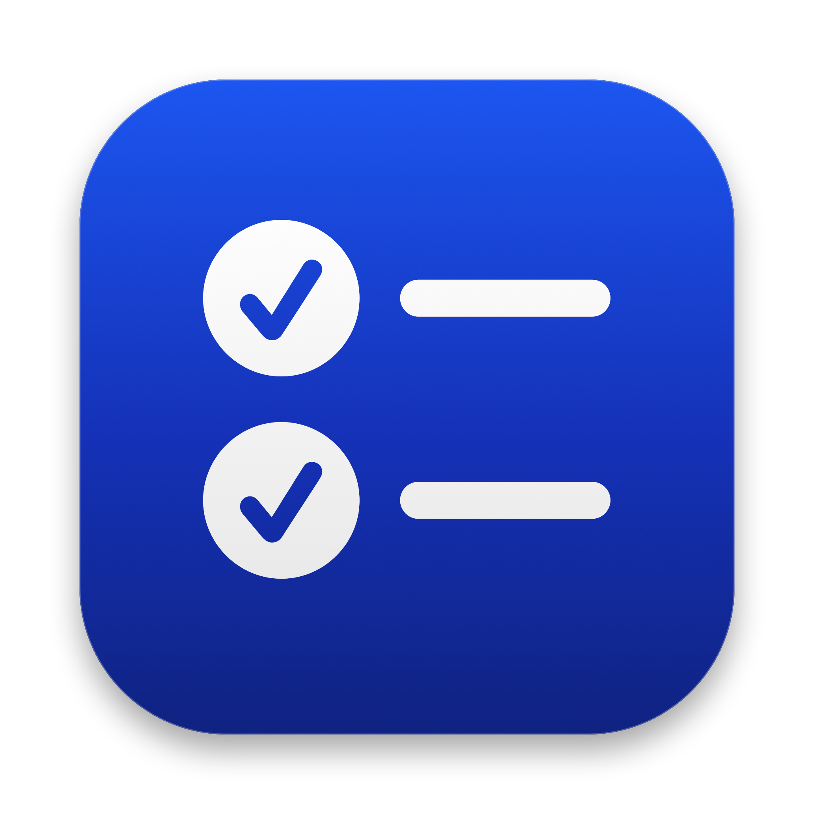

<p align="center">
  
</p>

<h1 align="center">Daily Task</h1>

<p align="center">
  <strong>A lightweight, native, and fast menu bar task manager & to-do list for macOS.</strong>
</p>

<p align="center">
  <a href="https://github.com/nhanchaukp/DailyTask"></a>
  <a href="https://swift.org"></a>
  <a href="LICENSE"></a>
  <a href="https://github.com/nhanchaukp/DailyTask/releases"></a>
  
  
</p>

---

## 📖 Overview

**Daily Task** is an ultra-fast, minimalist menu bar to-do and productivity application tailored specifically for macOS. Built purely in modern **SwiftUI** with the **Observation framework**, it resides right in your Mac's menu bar to keep your daily focus accessible with a single click—without disrupting your workflow.

---

## ✨ Key Features

- 📌 **Menu Bar Native Integration**:
  - Live menu bar icon with a real-time badge indicating remaining incomplete tasks.
  - Pops up instantaneously with a compact, distraction-free window.

- 📅 **Smart Date Grouping & Due Dates**:
  - Automatically categorizes tasks by date: *Quá hạn (Overdue)*, *Hôm nay (Today)*, *Ngày mai (Tomorrow)*, and specific upcoming dates.
  - Docked sticky section headers with count badges for effortless scanning.
  - Built-in date picker for quick due date scheduling.

- 🏷️ **Tagging & Quick Filters**:
  - Add comma-separated tags to any task (e.g. `việc nhà`, `họp`, `dự án`).
  - Interactive horizontal filter bar lets you filter tasks by tag in one click.

- 🔍 **Instant Search**:
  - Real-time search by task title or tag keywords with one-click clear button.

- ⚡ **Snappy Interactions & Micro-animations**:
  - Single-click or double-click to toggle task completion.
  - Smooth strikethrough transition and subdued styling for completed items.
  - Option to automatically reorder completed items to the bottom.
  - One-click bulk cleanup to clear completed tasks.

- ☁️ **iCloud Sync**:
  - Seamless background synchronization across your Macs using `NSUbiquitousKeyValueStore`.
  - Manual sync trigger available anytime.

- 📊 **Excel / CSV Export**:
  - Export your complete task history, creation dates, due dates, tags, and statuses directly to `.csv` for reporting and spreadsheets.

- 🔄 **Built-in Auto Update Checker**:
  - Checks GitHub Releases directly for new versions.
  - Automatically fetches the correct `.dmg` package for your Mac architecture (Apple Silicon vs Intel).

- 🔒 **Privacy-First & 100% Offline Capable**:
  - All data is stored locally on your device and in your personal iCloud container. No third-party servers, tracking, or ads.

---

## 📋 Requirements

- **Operating System**: macOS 14.0 (Sonoma) or newer (Fully compatible with macOS Sequoia)
- **Architecture**: Universal binary (Apple Silicon `arm64` & Intel `x86_64`)
- **Xcode**: 15.0+ or 16.0+ (for building from source)

---

## 🛠️ Installation

### Install via Homebrew Cask

```bash
brew tap nhanchaukp/tap
brew install --cask dailytask
```

### Direct Download (DMG)

Download the latest pre-built disk image from the [GitHub Releases](https://github.com/nhanchaukp/DailyTask/releases) page:

| Package | Target Mac Architecture |
| :--- | :--- |
| 🍏 **DailyTask-arm64.dmg** | Native for Apple Silicon (M1, M2, M3, M4, etc.) |
| 🖥️ **DailyTask-x86_64.dmg** | Native for Intel-based Macs |
| 🌐 **DailyTask.dmg** | Universal binary (Works on any Mac) |

Drag `Daily Task.app` into your `/Applications` folder and launch!

---

## 🔨 Building from Source

1. **Clone the repository**:
   ```bash
   git clone https://github.com/nhanchaukp/DailyTask.git
   cd DailyTask
   ```

2. **Open the project in Xcode**:
   ```bash
   open DailyTask.xcodeproj
   ```

3. **Build and Run**:
   - Scheme: `DailyTask`
   - Destination: `My Mac`
   - Press <kbd>⌘</kbd> + <kbd>R</kbd> to compile and run.

---

## 🏗️ Architecture & Technology Stack

- **Framework**: Pure [SwiftUI](https://developer.apple.com/xcode/swiftui/) + modern [Observation](https://developer.apple.com/documentation/observation) framework (`@Observable`).
- **Target OS**: macOS AppKit `MenuBarExtra` window-style presentation.
- **Data Persistence**: Local JSON persistence via `UserDefaults` with conflict-resilient `NSUbiquitousKeyValueStore` iCloud replication.
- **Exporting**: `UniformTypeIdentifiers` with standard CSV serialization.
- **CI/CD**: GitHub Actions workflow generating multi-architecture signed and notarized DMGs with automated Homebrew formula synchronization.

---

## 🤝 Contributing

Contributions, feedback, and pull requests are warmly welcomed!

1. Fork the Project
2. Create your Feature Branch (`git checkout -b feature/AmazingFeature`)
3. Commit your Changes (`git commit -m 'Add some AmazingFeature'`)
4. Push to the Branch (`git push origin feature/AmazingFeature`)
5. Open a Pull Request

---

## 📄 License

This project is open-source and licensed under the **MIT License**. See the [LICENSE](LICENSE) file for more information.

Copyright © 2026 **nhanchaukp (Châu Thái Nhân)**. All rights reserved.
